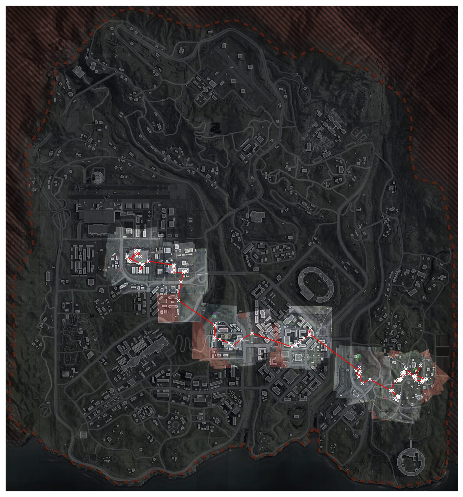

# warzone-mapper

Call of Duty: Warzone Game Analysis and Mapper

## Roadmap

- [ ] Automatically detect minimap location for different resolutions
- [ ] Optimize warping (threadpool)
- [ ] Read match ID from bottom left (use multiple frames)
  - [ ] Gulag win or loss from wzstats
  - [ ] Show total kills and k/d
- [ ] Player count progression (via color bar legend)
- [ ] Include death locations (check for 'Killed by')
- [ ] Use kill counter at top right to check for new kill (left: 1792, top: 18)
  - [ ] Read all killed players stats (via bottom center)
  - [ ] Include kill locations
- [ ] Run over existing twitch vods (url params for start time)
- [ ] Spectating detection

:slight_smile:
